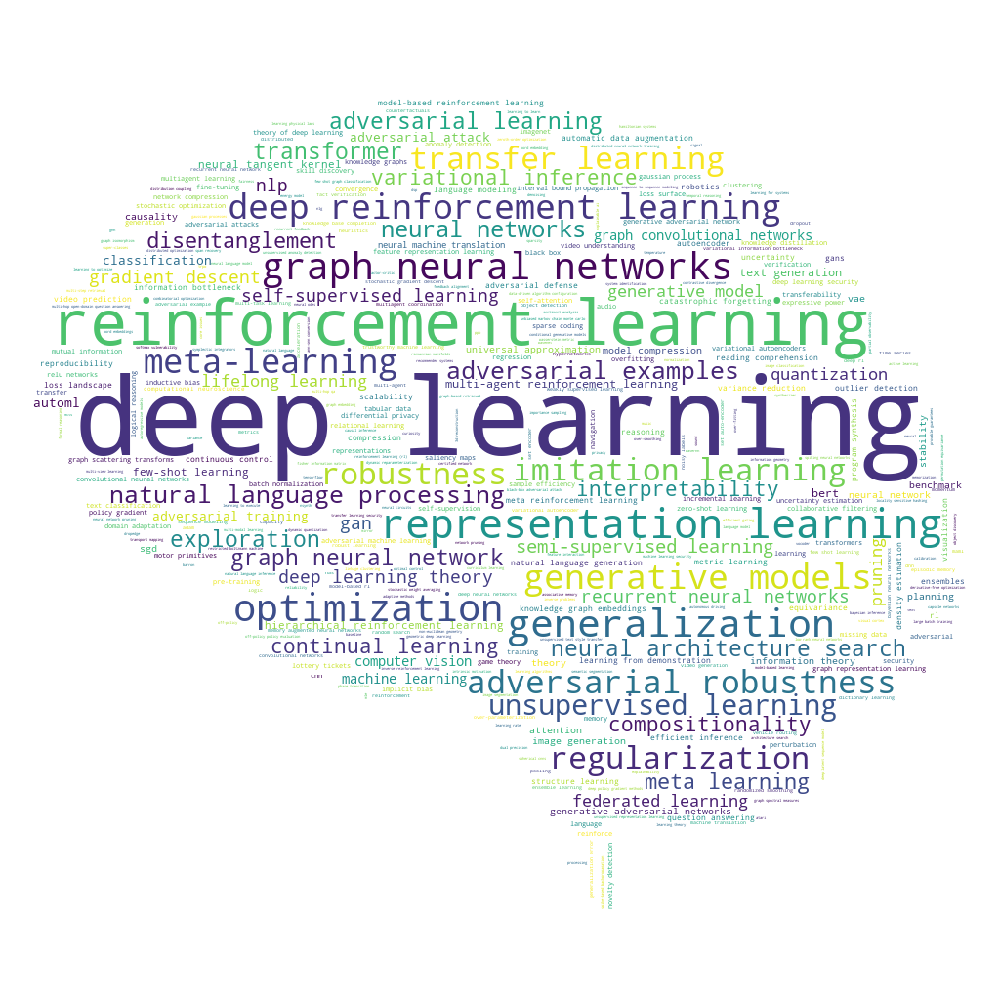

Web crawler for [ICLR 2020 OpenReview web page](https://openreview.net/group?id=ICLR.cc/2020/Conference)

### Analysis
#### Total accepted paper: 687
#### Top-10 Keywords
- deep learning: 64 times
- reinforcement learning: 53 times
- Deep Learning: 31 times
- Reinforcement Learning: 27 times
- generalization: 19 times
- optimization: 18 times
- graph neural networks: 15 times
- representation learning: 15 times
- regularization: 13 times
- meta-learning: 13 times

### WordCloud

